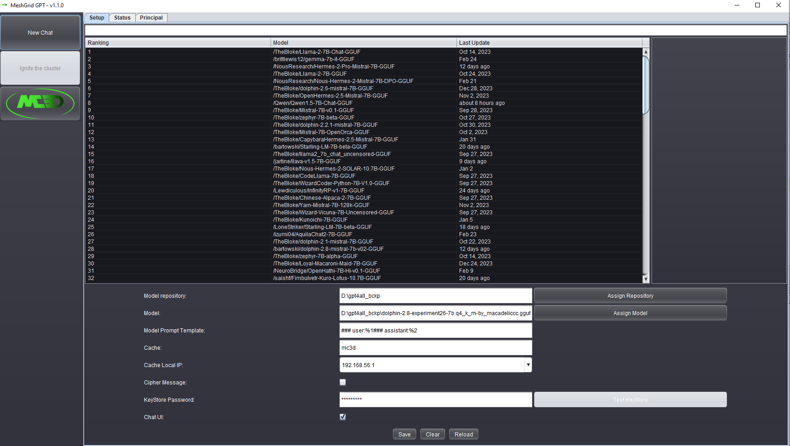
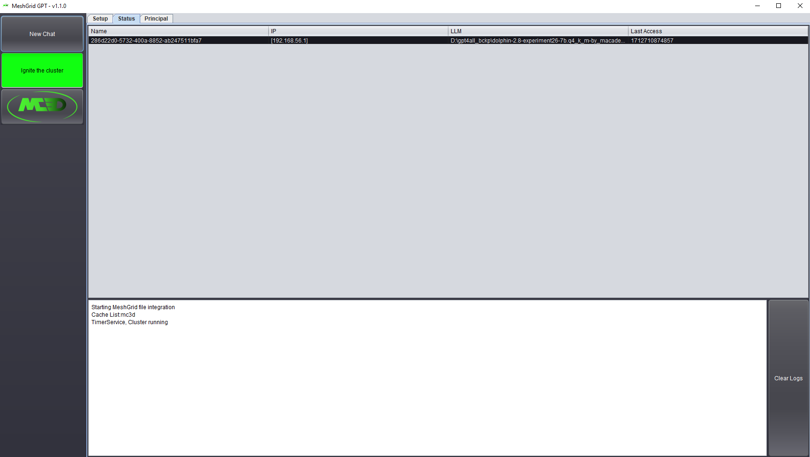
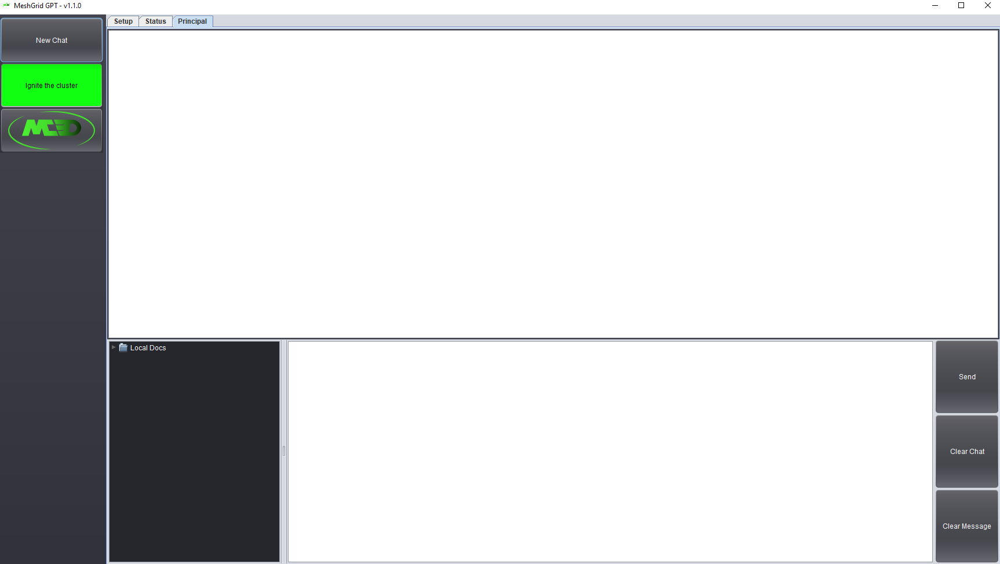

 
# MeshGrid_GPT by MC3D
<h2>GPT Chat with Local and Network Data Grid</h2>
Multi nodes Chat by UI and files interchange.
<ul>
<li>The backend is GPT4ALL 2.7.0 and 2.7.1.</li>
<li>The replication of data in memory is using Apache Ignite 2.16.0</li>
<li>The development is completely in Java 8 for old compatibility.</li>
<li>The UI interface was developed in JavaSwing because the viewer has support for HTML and it runs in many JRE, it interface can be hide by configuration.</li>
<li>Localdocs using Apache PDFBox, we have support for PDF and TXT in MeshGrid-GPT 1.1.0.</li>
<li>The DataGrid is enable configuring the Cache name  in the UI Interface.</li>
<li>The data can be cipher for in transit information creating a PKCS12/PFX KeyStore and share it with the differents nodes, the name of the keystore must be <cache_name>.pfx</li>
<li>The data for in transit data is cipher with AES using part of the public key of the Alias <cache> in the keystore.</li>
<li>The models tested and compatibles with MeshGrid are 7B GGUF, the UI provide a interface with a list of top download models from Hugging Face, and is possible download each one with double click.</li>
<li>The Status Panel in the console is a log of local events and show the Nodes of the Cache with the LLM active.</li>
<li>The Chat Panel has a Principal, and you can to add more chat and change the name for either of it</li>
<li> The Context Size is setted in 32k</li>
</ul>
Starting downloading from the folder Binaries 3 files: 
  <ol>
<li><a href="https://github.com/mastercracker3d/MeshGrid-GPT/raw/main/binaries/MeshGrid_GPT-v1.1.0.zip">MeshGrid_GPT-v1.1.0.zip</a></li>
<li><a href="https://github.com/mastercracker3d/MeshGrid-GPT/raw/main/binaries/MeshGrid_GPT-v1.1.0.z01">MeshGrid_GPT-v1.1.0.z01</a></li>
<li><a href="https://github.com/mastercracker3d/MeshGrid-GPT/raw/main/binaries/MeshGrid_GPT-v1.1.0.z02">MeshGrid_GPT-v1.1.0.z02</a></li>
  </ol>
  Uncompress MeshGrid_GPT-v1.1.0.zip in one or more Base folder. 
  Use JRE or JDK >=8 with JavaFX 
  <h2>Setup screen example</h2>
   
  <h2>Data Grid Status screen example</h2>
   
  <h2>Principal Chat screen example</h2>
   
  <h2>Multi Chat screen example</h2>
   
